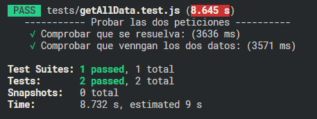

## Rick and Morty API

Este es un Back-End hecho en Node.js y Express.js.

## Getting Started

Primero, instalar el package.json:

```
bash
npm install
```

Luego, lanzar el servidor

```bash
npm run dev
# or
yarn dev
```

Usar Postman para hacer el llamado a las rutas o en el navegador:

1. Para ver los resultados:
```
localhost:3001/getdata
```
Al hacer esta peticion vas a obtener una respuesta como esta:
```
[
    {
        "exercise_name": "Char counter",
        "time": "1.5s to 2s",
        "in_time": true,
        "results": [
            {
                "char": "l",
                "count": 63,
                "resource": "location"
            },
            {
                "char": "e",
                "count": 39,
                "resource": "episode"
            },
            {
                "char": "c",
                "count": 387,
                "resource": "character"
            }
        ]
    },
    {
        "exercise_name": "Episode locations",
        "time": "3s",
        "in_time": true,
        "results": [
            {
                "name": "Pilot",
                "episode": "S01E01",
                "locations": [
                    "Citadel of Ricks",
                    "Bepis 9",
                    "Earth (C-137)",
                    "unknown",
                    "Interdimensional Customs",
                    "Earth (Replacement Dimension)",
                    "Worldender's lair"
                ]
            },...more data
            ]
    }
]
  
```
El tiempo de respuesta depende de la velocidad de internet, en priomedio ```3s```

#
El Código está organizado en carpetas, tenemos el archivo ```ìndex.js``` en la raiz del proyecto, que se encarga de recibir la petición y la conexion con el puerto,
esta petición va hacia la carpeta ```routes``` donde está el archivo ```getCharactersEpisodes.js```, éste recibe la ruta y llama a la función ```getAllData``` ubicada en la carpeta ```controladores```, éste archivo tiene una función que realiza un ```Promise.all``` a las dos funciones que se encargan de pedir los datos:
    <ol>
        <li>```obtenerCaracteres: ``` 
                Esta funcion se encuentra dentro del archivo ```charcounter``` y se encarga de realizar un ```Promise.all``` a los 3 endpoints de char counter, y esta función ```llamado``` recibe por parámeto la url principal, la url de las paginas, el tipo de character y la letra.
                    Con estos datos realiza la petición y cuenta la cantidad e veces que aparece la letra en ese endpoint. 
                La funcion ```endPoint``` recibe dos parámetros, uno es la pagina a la que se quiere navegar, y la otra es el a que parte, ejemplo si queres ir a ```episodes``` o a ```characters```, etc. Todos los endpoints estan en la carpeta ```utils```
        </li>
        <li>```getAllEpisodes: ```
                Esta funciion se encuentra dentro de la carpeta ```controladores``` en el archivo ```getEpisodes.js```, la misma realiza el llamado al endpint principal y a partir de ahi recorre las paginas de la api, almacenando en cada recorridos los datos que se solicitan para mandar la respueta en formato Json. 
        </li>
    </ol>


<h2>Tests</h2>
<p>Para correr los test pone en consola ```npm run test``` y vas a obtener un resultado similar a este</p>

